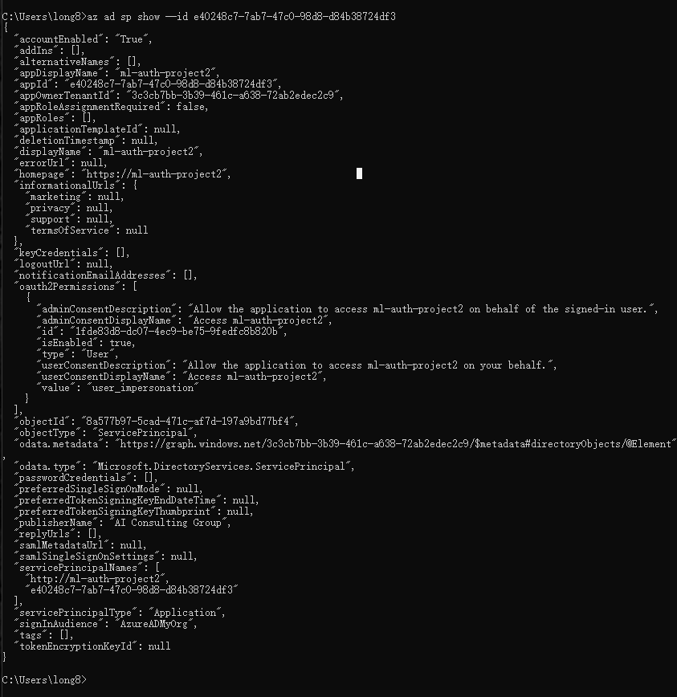
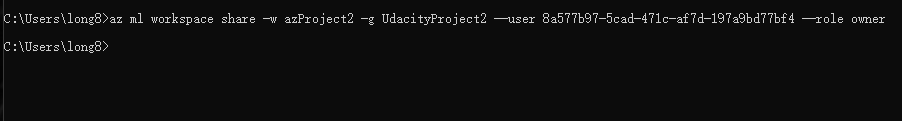
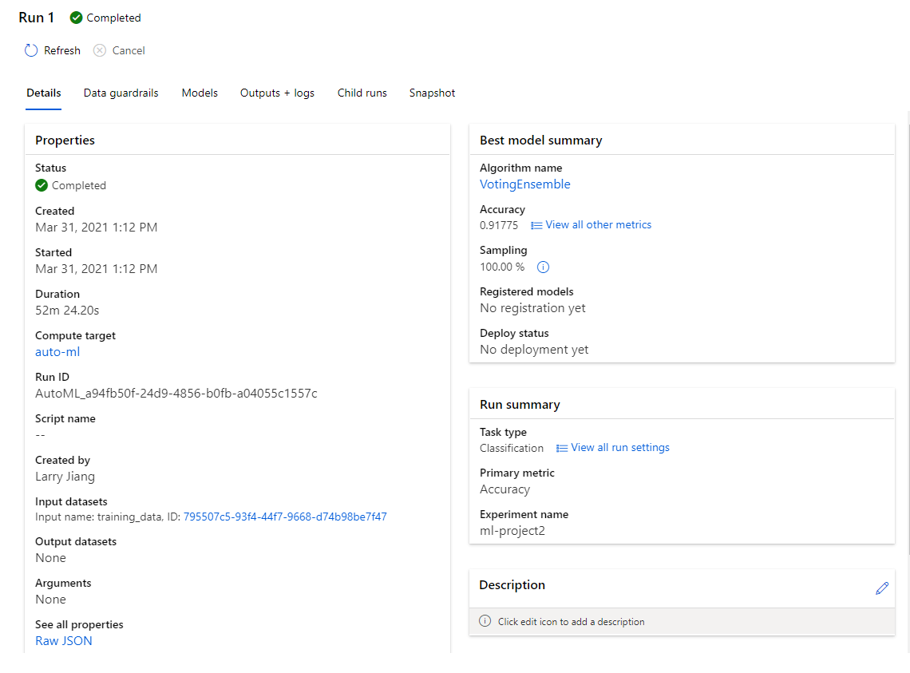
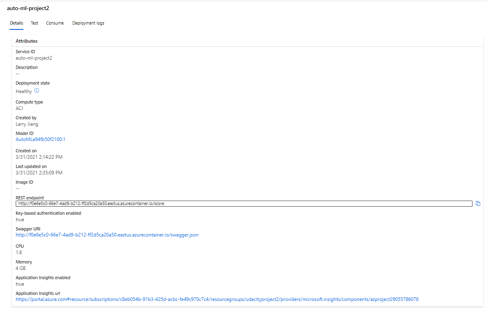
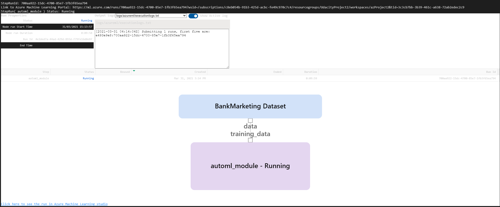
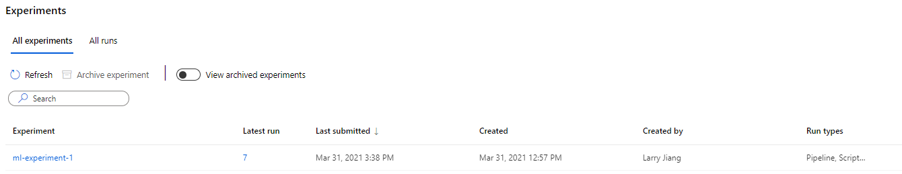
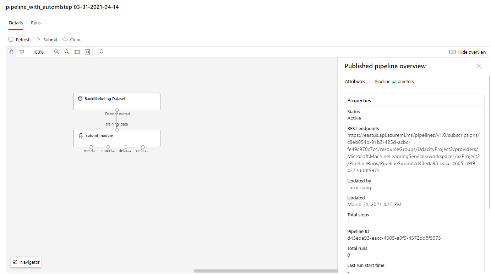
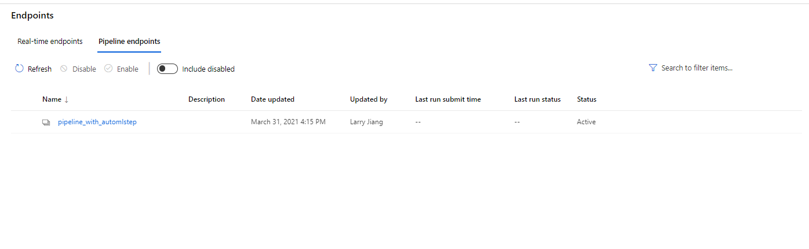

# Azure Auto Machine Learning and Pipeline

The project 2, the Bank Marketing dataset has been used to train a machine learning model in the  Azure Machine Learning Studio and then configure it for production and deploy it using Azure Container Instance and consume it using REST endpoints. We will also create, publish and consume a pipeline.

## Architectural Diagram

From above architectural diagram, we are able to understand how the Azure machine learning process works.

1. Regster a dataset
2. Enable service principle
3. Configure the AutoML details such as type of machine learning task (e.g classification or regression), in our case
is classification task, set up exit criteria, runing time and etc, then we are able to select the best model after training
4. Deploy the the best model to azure container instance (ACI)
5. Enable logging and application insights for tracking the performance of deployed model and number of requests
6. After deployment, the REST API in pyhon and swagger will be used to interact with the deployed model with sample data and check its prediction results
7. Using python SDK create pipeline and then deployment, and publish it.
## Key Steps
Step 1: Enable authentication by adding service principle, because authentication is crucial for the continuous flow of operations. If the authentication is not set
properly, it requires human interaction and the flow is interrupted.

Step 2: Display the workspace share completed without any errors, this allows the service principle to access to workspace.

Step 3: Import the dataset into Azure Machine Learning Studio, and resgiter it

Step 4: After the AutoML has finished its running. The created experiment will also be finished

 

Step 5: Now we will pick up the best model for deployment

Step 6: We choose the best model for deployment and enable "Authentication" while deploying the model using Azure Container Instance (ACI). The executed code in logs.py enables Application Insights. "Application Insights enabled" is disabled before executing logs.py.

Step 7: Consume the deployed model using Swagger. Swagger is tool to for build, document and consume RESTful web services. It can send HTTP requests that the API 
can consume like POST and GET.

Step 8: Create ML pipeline based on AutoML, then the pipeline will be published to be comsumed. User can input request via HTTP POST request that is used to submit data.
The API exposed by Azure ML will use JSON format to accept data and submit responses. It serves as a bridge language among different environments.

## Standout Suggestions
We could create a intractive web site as deployment endpoint to allow user inpute and display prediction result. Also the 
whole application can be containerised with docker and host on a web server.

