*NOTE:* This file is a template that you can use to create the README for your project. The *TODO* comments below will highlight the information you should be sure to include.

# Your Project Title Here

The project 2, the Bank Marketing dataset has been used to train a machine learning model in the  Azure Machine Learning Studio and then configure it for production and deploy it using Azure Container Instance and consume it using REST endpoints. We will also create, publish and consume a pipeline.

## Architectural Diagram

From above architectural diagram, we are able to understand how the Azure machine learning process works.

1. Regster a dataset
2. Enable service principle
3. Configure the AutoML details such as type of machine learning task (e.g classification or regression), in our case
is classification task, set up exit criteria, runing time and etc, then we are able to select the best model after training
4. Deploy the the best model to azure container instance (ACI)
5. Enable logging and application insights for tracking the performance of deployed model and number of requests
6. After deployment, the REST API in pyhon and swagger will be used to interact with the deployed model with sample data and check its prediction results
7. Using python SDK create pipeline and then deployment, and publish it.
## Key Steps
Step 1: Enable authentication by adding service principle

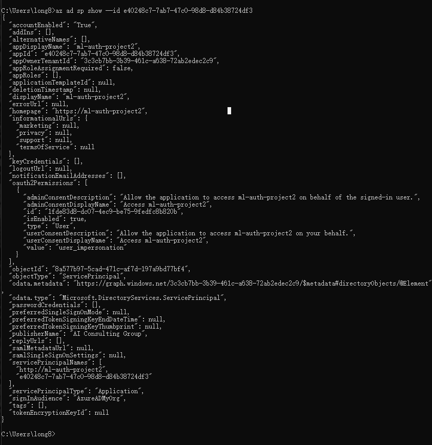

Step 2: Display the workspace share completed without any errors

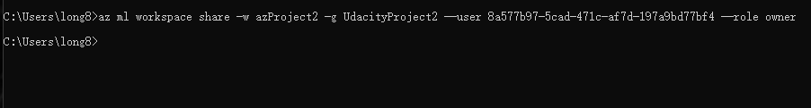

Step 3: Import the dataset into Azure Machine Learning Studio, and resgiter it

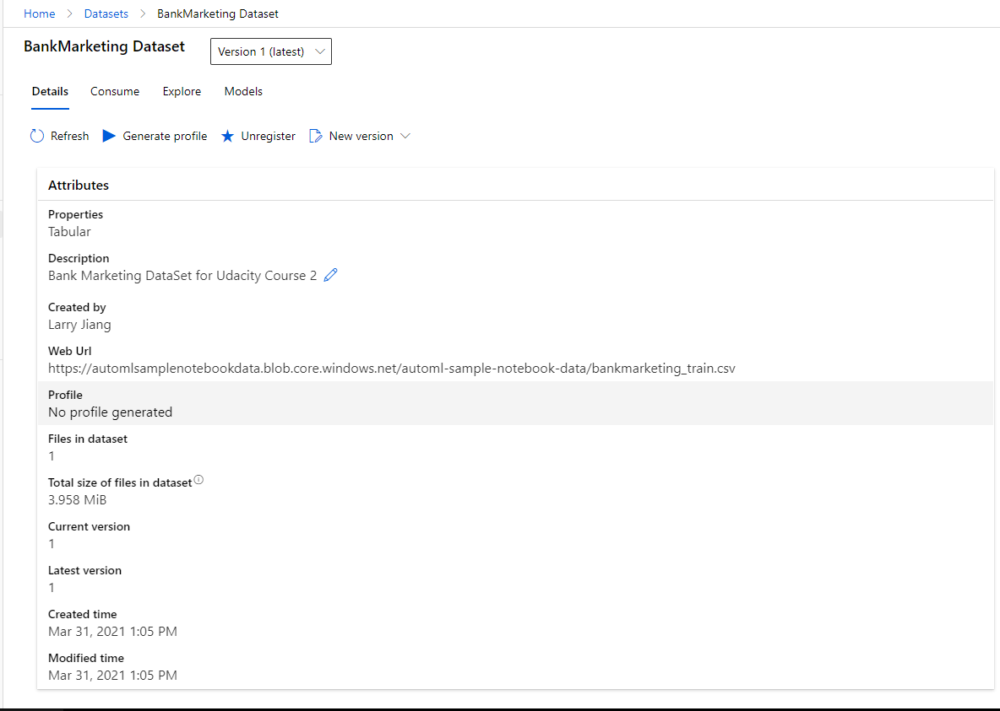

Step 4: After the AutoML has finished its running. The created experiment will also be finished

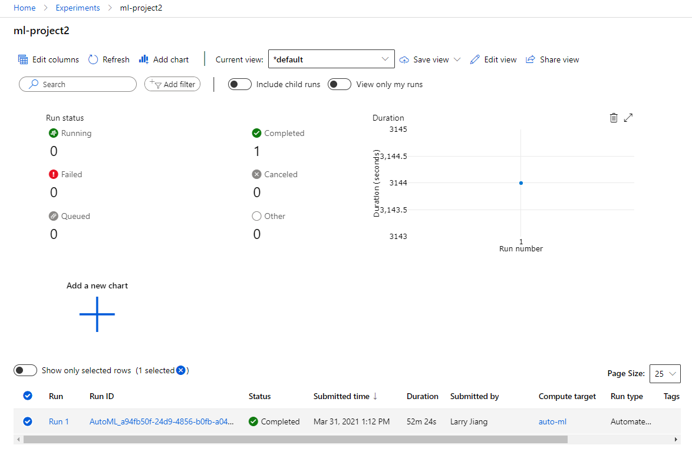 

Step 5: Now we will pick up the best model for deployment

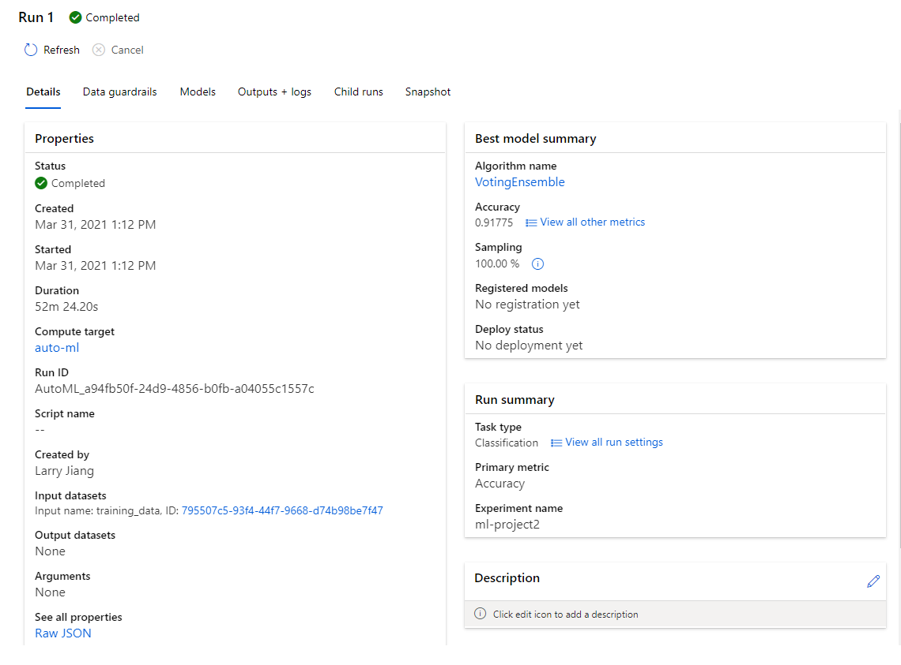

Step 6: After the model has successfully deployed, the Application Insights have been enabled and logging info has been retrived

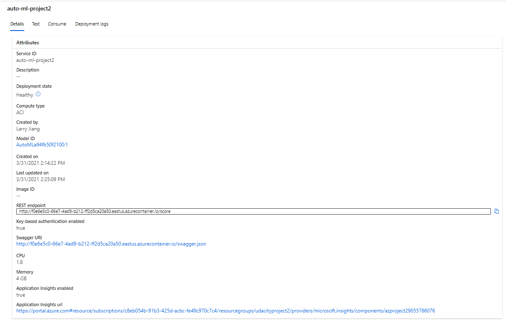
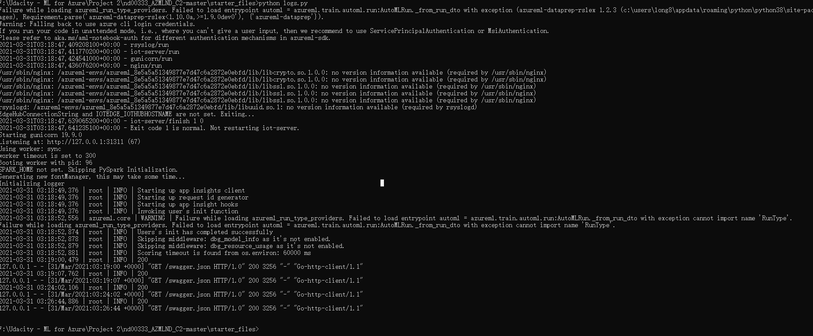

Step 7: Consume the deployed model using Swagger, the test data will input into JSON and send to deployed model for test

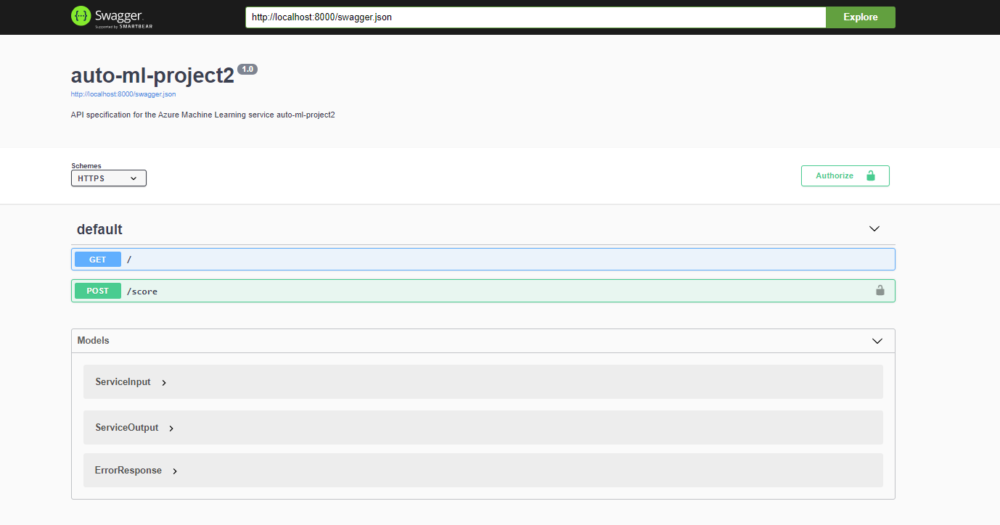
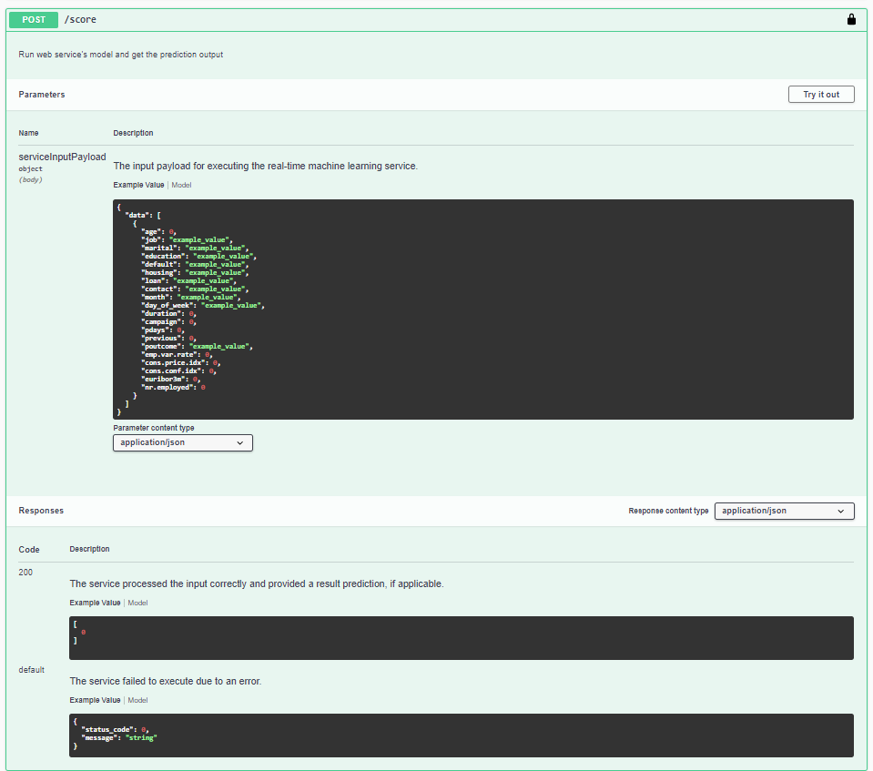

Step 8: Create ML pipeline based on AutoML, then the pipeline will be published to be comsumed

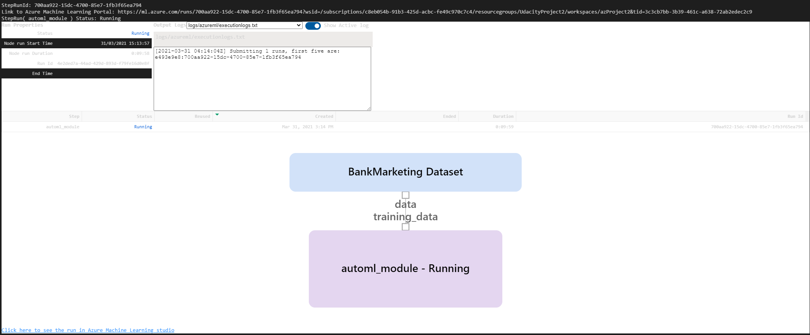

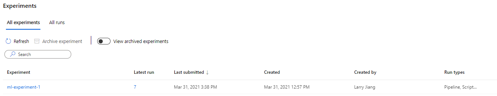

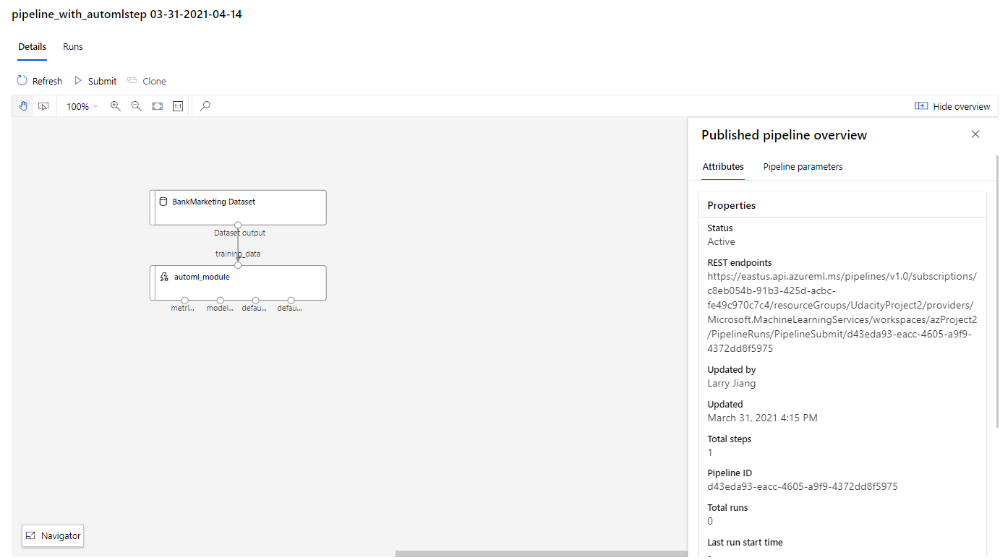

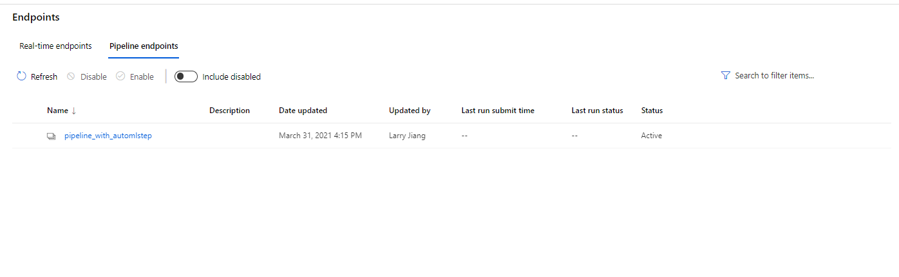

## Screen Recording
https://www.dropbox.com/s/8vg4z2p103h308e/screencast.mp4?dl=0

## Standout Suggestions
We could create a intractive web site as deployment endpoint to allow user inpute and display prediction result. Also the 
whole application can be containerised with docker and host on a web server.

